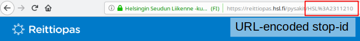

# Terminal application for TI slient 700 with broken keys

We have a ti slient 700, and we wanted to connect it to something useful.

Unfortunately it only sends in uppercase so using it as a modern day terminal alone is sort of out of the question. So this application allows us to run and develop applications for it which are vaugely useful.

## Developing an application

Make a new class somewhere in `apps/`. Inherit `TerminalApp` follow the docstring

use `python mainterminal.py --dummy` to prototype

### Reittiopas application

